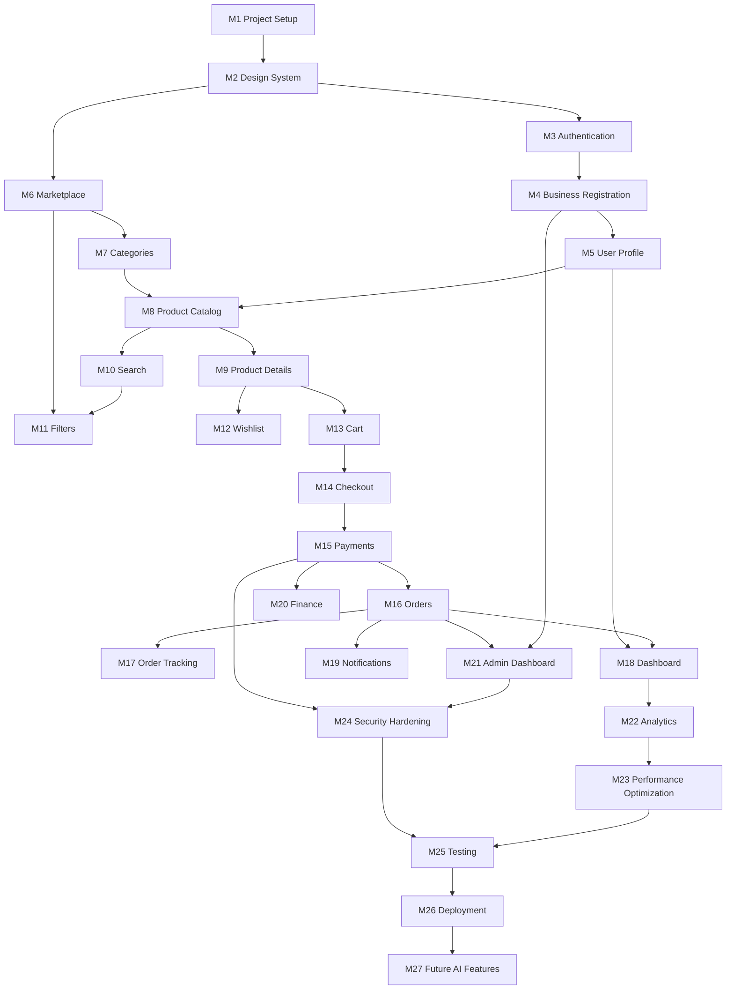

# VyaparSetu — Implementation Roadmap (v1.0)

27 dependency-ordered milestones. Each is scoped to a single Lovable build prompt. Stack assumed from Prompts 1–2 (TanStack Start + Lovable Cloud + Tailwind v4 + shadcn/ui).

**Legend per milestone:** Obj · Feat · New Comp · Reuse · DB · Cloud · API · State · Validation · Test · Accept · Deps · Risks · Deliverables.

---

## M1 — Project Setup
- **Objective:** Bootstrap a clean, typed, lint-clean TanStack Start app with routing + query wired.
- **Features:** Router shell, root layout, providers, error/404 boundaries, base head metadata, favicon, health check.
- **New Components:** `AppShell`, `Header` (marketing), `Footer`, `NotFound`, `RootError`, `Logo`.
- **Reuse:** shadcn ui primitives.
- **DB Changes:** none.
- **Cloud (Supabase):** none yet.
- **API:** `/api/public/health.ts` route.
- **State:** `QueryClient` in router context, `defaultPreloadStaleTime: 0`.
- **Validation:** Zod installed, base `lib/validators.ts` scaffold.
- **Testing:** Type-check passes, dev server boots, `/` renders, `/does-not-exist` shows 404, `/api/public/health` → 200.
- **Acceptance:** No placeholder blank page; brand name/title in head; router preloads on intent.
- **Dependencies:** none.
- **Risks:** Bad router setup blocks everything.
- **Deliverables:** Working skeleton repo.

## M2 — Design System
- **Objective:** Ship tokens, typography, and core primitives per Prompt 2 §C.
- **Features:** Color tokens (oklch), fonts loaded via `<link>` in `__root.tsx`, dark mode, spacing, radii, gradients, shadows, motion utilities.
- **New Components:** `Button` variants, `Card`, `Badge`, `Alert`, `Dialog`, `Sheet`, `Drawer`, `Input`, `Select`, `Textarea`, `Checkbox`, `RadioGroup`, `Switch`, `Tabs`, `Tooltip`, `Toast (sonner)`, `Skeleton`, `EmptyState`, `PageHeader`, `StatusPill`, `KpiCard`, `DataTable`, `Stepper`.
- **Reuse:** shadcn where available.
- **DB:** none.
- **Cloud:** none.
- **API:** none.
- **State:** ThemeProvider (light/dark/system).
- **Validation:** WCAG AA contrast check on token pairs.
- **Testing:** Storybook-style demo route `/legal/design-preview` (dev-only) shows all primitives; motion respects reduced-motion.
- **Acceptance:** No hardcoded colors in components; all tokens in `styles.css`.
- **Dependencies:** M1.
- **Risks:** Token drift later if not enforced.
- **Deliverables:** Reusable UI kit.

## M3 — Authentication
- **Objective:** Sign up / sign in / sign out / reset via Lovable Cloud + Google OAuth.
- **Features:** Email+password, Google (Lovable broker), forgot & reset password page, session listener, sign-in affordance in header.
- **New Components:** `AuthPage`, `SignInForm`, `SignUpForm`, `ForgotPasswordForm`, `ResetPasswordPage`, `AccountMenu`.
- **Reuse:** M2 primitives.
- **DB:** `profiles` table + trigger auto-create on signup.
- **Cloud:** Enable Lovable Cloud; enable Email + Google; HIBP on; configure social auth for Google.
- **API:** `getMyProfile` server fn (`requireSupabaseAuth`).
- **State:** Root `onAuthStateChange` filtered; sign-out hygiene sequence.
- **Validation:** Email format, password ≥8, HIBP.
- **Testing:** Signup → email flow, login, wrong password error, reset link works, Google OAuth, sign-out clears cache & redirects.
- **Acceptance:** Header reflects session; managed `_authenticated/route.tsx` present.
- **Dependencies:** M2.
- **Risks:** OAuth redirect misconfig; forgetting `/reset-password`.
- **Deliverables:** Working auth surface.

## M4 — Business Registration & KYC intake
- **Objective:** Multi-step onboarding to create a business + upload KYC docs.
- **Features:** Role select, business form (GSTIN/PAN/address), KYC uploads, bank details, submit for review.
- **New Components:** `OnboardingWizard`, `RoleSelector`, `BusinessForm`, `KycUploader`, `BankForm`, `ReviewSubmitStep`, `KycStatusBanner`.
- **Reuse:** Stepper, Form primitives, DocumentUploader.
- **DB:** `businesses`, `business_members`, `user_roles` (+enum `app_role`), `kyc_documents`, `bank_accounts`, `has_role()` fn.
- **Cloud:** `kyc-docs` (private) + `bank-proofs` bucket; RLS + GRANTs; trigger to insert default `retailer` role on membership.
- **API:** `upsertBusinessDraft`, `uploadKycDoc`, `submitForReview`, `getMyBusinesses`.
- **State:** `useCurrentBusiness` context.
- **Validation:** GSTIN checksum, PAN Luhn, IFSC, pincode.
- **Testing:** Draft save/resume, file size/type limits, submit toggles status to `pending`.
- **Acceptance:** New user reaches dashboard with "KYC pending" banner; docs land in private bucket.
- **Dependencies:** M3.
- **Risks:** Storage RLS misconfig exposing PII.
- **Deliverables:** Verified-business intake pipeline.

## M5 — User Profile
- **Objective:** Manage personal profile, business switching, members.
- **Features:** Edit profile, avatar upload, business switcher, invite members with role.
- **New Components:** `ProfilePage`, `AvatarUploader`, `BusinessSwitcher`, `MembersTable`, `InviteMemberDialog`.
- **Reuse:** M2 forms, dialogs.
- **DB:** `business_invitations`, RLS for `business_members`.
- **Cloud:** `avatars` public bucket.
- **API:** `updateProfile`, `switchBusiness`, `inviteMember`, `respondInvitation`, `listMembers`.
- **State:** Active business persisted in profile + query cache.
- **Validation:** Email invites, role enum.
- **Testing:** Switch business updates all queries; invite email sent; invitee joins.
- **Acceptance:** Global business context drives downstream queries.
- **Dependencies:** M4.
- **Risks:** Cross-tenant leakage on switch (cache clear required).
- **Deliverables:** Multi-tenant identity UX.

## M6 — Marketplace Shell
- **Objective:** Public marketplace layout with grid & sort (no filters yet).
- **Features:** `/marketplace`, product grid, sort, pagination, promoted rail.
- **New Components:** `MarketplaceLayout`, `ProductCard`, `SortBar`, `Pagination`, `PromotedRail`.
- **Reuse:** Card, Badge, Skeleton.
- **DB:** none new (uses catalog from M8 once seeded; use seed fixtures now).
- **Cloud:** `product-images` public bucket.
- **API:** `listProducts({sort,page})` public via server publishable client.
- **State:** URL search params for sort/page.
- **Validation:** Query param schemas.
- **Testing:** SSR renders grid, preload on intent works, pagination updates URL.
- **Acceptance:** Public route indexable; meta tags set.
- **Dependencies:** M2 (M8 provides real data; seed acceptable interim).
- **Risks:** Rendering without live catalog — use fixtures & swap.
- **Deliverables:** Public catalog skeleton.

## M7 — Categories
- **Objective:** Category tree + landing pages.
- **Features:** `/marketplace/category/$slug`, breadcrumbs, sub-chips.
- **New Components:** `CategoryHero`, `SubcategoryChips`, `Breadcrumbs`, `CategoryNav`.
- **Reuse:** ProductCard, ProductGrid.
- **DB:** `categories` (parent_id, slug, level) with seed.
- **Cloud:** public SELECT RLS on categories.
- **API:** `getCategory(slug)`, `getCategoryTree`.
- **State:** URL-driven category filter.
- **Validation:** Slug regex.
- **Testing:** Deep link works; unknown slug → 404 route.
- **Acceptance:** Each category has unique head() metadata.
- **Dependencies:** M6.
- **Risks:** N+1 on tree fetch — cache.
- **Deliverables:** Category browsing.

## M8 — Product Catalog (Seller CRUD)
- **Objective:** Sellers list/create/edit products with variants + tier pricing.
- **Features:** `/seller/products`, new/edit forms, image upload, tier pricing matrix, MOQ, HSN, GST%, publish flow.
- **New Components:** `CatalogTable`, `ProductForm`, `VariantEditor`, `PricingMatrix`, `MoqInput`, `BulkImageUploader`, `PublishToggle`.
- **Reuse:** DataTable, Forms.
- **DB:** `products`, `product_variants`, `price_tiers`, `brands`, `inventory`, `warehouses`; enums; RLS: seller CRUD, public read `status='live'`.
- **Cloud:** GRANTs; triggers to auto-audit product changes.
- **API:** `createProduct`, `updateProduct`, `publishProduct`, `listMyProducts`, `uploadProductImage`.
- **State:** Query cache keyed by seller + status.
- **Validation:** HSN, GST %, MOQ ≥1, unique SKU per seller, tier prices monotonically decreasing.
- **Testing:** Draft → publish gates on KYC-approved; RLS blocks other sellers.
- **Acceptance:** Public marketplace now shows real live products.
- **Dependencies:** M5, M7.
- **Risks:** Complex pricing UX; validate tier ordering.
- **Deliverables:** End-to-end seller catalog.

## M9 — Product Details Page
- **Objective:** Rich PDP with tier pricing, MOQ, variants, reviews.
- **Features:** `/product/$id`, gallery, variant selector, qty stepper with live tier price, pincode ETA, tabs, related products, sticky mobile CTA.
- **New Components:** `ImageGallery`, `TierPriceTable`, `VariantSelector`, `QtyStepper`, `PincodeCheck`, `PdpTabs`, `RelatedRail`, `StickyBuyBar`.
- **Reuse:** Card, Badge, VerifiedBadge.
- **DB:** `reviews` table (Phase 1 read-only display).
- **Cloud:** none.
- **API:** `getProduct(id)`, `getRelated(id)`, `checkPincode`.
- **State:** Local selection state; server-fetched product.
- **Validation:** Qty ≥ MOQ, variant required.
- **Testing:** Tier price recalculates; SSR meta with product title/og image.
- **Acceptance:** Add-to-cart CTA present but gated to auth (M13).
- **Dependencies:** M8.
- **Risks:** Image LCP performance.
- **Deliverables:** Conversion-ready PDP.

## M10 — Search
- **Objective:** Fast typo-tolerant text search.
- **Features:** `/marketplace/search`, autocomplete, results, zero-state, recent searches.
- **New Components:** `SearchInput`, `SuggestionsList`, `ZeroResults`, `RecentSearchesChip`.
- **Reuse:** ProductGrid.
- **DB:** `product_search_tsv` column + GIN index + trigram; `recent_searches` (per user, optional).
- **Cloud:** RLS unchanged.
- **API:** `autocomplete(q)`, `searchProducts({q,...})`.
- **State:** Debounced input; URL `q` param.
- **Validation:** Query length ≥1, sanitize.
- **Testing:** Typos matched; ranking sane; SSR indexable.
- **Acceptance:** P95 <400ms on seeded data.
- **Dependencies:** M8.
- **Risks:** Vernacular tokens; roadmap Meilisearch later.
- **Deliverables:** First-class search.

## M11 — Filters
- **Objective:** Faceted filters on marketplace/category/search.
- **Features:** Category, price, MOQ, brand, location, verified-only, rating; active chips; sheet on mobile.
- **New Components:** `FiltersSidebar`, `FilterSheet`, `RangeSlider`, `FacetGroup`, `ActiveFilterChips`.
- **Reuse:** Checkbox, Slider.
- **DB:** materialized facet counts view (optional).
- **Cloud:** none.
- **API:** `searchProducts` extended with filter args + facets.
- **State:** URL-driven; typed via TanStack search validators.
- **Validation:** Numeric ranges, whitelist enums.
- **Testing:** Combining filters produces correct results; clear-all works; deep-linkable.
- **Acceptance:** Zero jitter on filter change; SSR respects filters.
- **Dependencies:** M6, M10.
- **Risks:** Facet count perf on large catalogs.
- **Deliverables:** Production-grade discovery.

## M12 — Wishlist / Saved Lists
- **Objective:** Buyers save products/suppliers for later.
- **Features:** Save from card & PDP; `/wishlist`; list management.
- **New Components:** `SaveButton`, `WishlistPage`, `SavedListCard`.
- **Reuse:** ProductCard, EmptyState.
- **DB:** `saved_lists`, `saved_list_items`; RLS owner-only.
- **Cloud:** GRANTs.
- **API:** `toggleSaved`, `listSaved`, `createList`.
- **State:** Optimistic toggle in query cache.
- **Validation:** Product exists.
- **Testing:** Toggle persists; unauth prompt to login.
- **Acceptance:** Save works from any surface.
- **Dependencies:** M9.
- **Risks:** Minor.
- **Deliverables:** Wishlist feature.

## M13 — Cart
- **Objective:** Multi-seller cart with tier pricing snapshot.
- **Features:** `/cart`, seller groups, qty change, remove, coupon, summary.
- **New Components:** `CartPage`, `SellerGroupCard`, `CartLine`, `CartSummary`, `CouponInput`, `MoqWarning`.
- **Reuse:** QtyStepper.
- **DB:** `carts`, `cart_items`; RLS owner.
- **Cloud:** GRANTs; SECURITY DEFINER `add_to_cart` fn respecting MOQ and price snapshot.
- **API:** `getCart`, `addToCart`, `updateCartItem`, `removeCartItem`, `applyCoupon`.
- **State:** Zustand slice for mini-cart badge; server truth via query.
- **Validation:** Qty ≥ MOQ per seller, stock availability.
- **Testing:** Below-MOQ blocks checkout; price updates live; coupon applied server-side.
- **Acceptance:** Cart survives sessions; per-seller subtotals correct.
- **Dependencies:** M9.
- **Risks:** Price drift vs snapshot; recompute at checkout.
- **Deliverables:** Robust cart.

## M14 — Checkout
- **Objective:** Convert cart to draft orders per seller.
- **Features:** Address, shipping options, payment method selection, review, place order (Prepaid + credit-days for MVP).
- **New Components:** `CheckoutStepper`, `AddressPicker`, `AddressForm`, `ShippingOptions`, `PaymentMethodSelector`, `OrderReview`, `TrustFootnote`.
- **Reuse:** Stepper, Forms, CartSummary.
- **DB:** `addresses`, draft `orders`, `order_items`, `order_events`; SECURITY DEFINER `place_order`.
- **Cloud:** RLS: buyer + seller members; GRANTs.
- **API:** `listAddresses`, `saveAddress`, `getShippingOptions`, `createOrderIntent`.
- **State:** Checkout wizard state (Zustand or route search).
- **Validation:** Address complete, KYC approved (retailer), MOQ, stock.
- **Testing:** Multi-seller cart → multiple orders; KYC-pending blocks with clear CTA.
- **Acceptance:** Order rows created atomically; audit event logged.
- **Dependencies:** M13.
- **Risks:** Race with stock; use row locks in SQL fn.
- **Deliverables:** Checkout MVP.

## M15 — Payments
- **Objective:** Prepaid payment via gateway with webhook reconciliation.
- **Features:** UPI/Card/NetBanking, escrow hold flag, retry, refund initiation stub.
- **New Components:** `PaymentModal`, `PaymentStatus`, `RetryPaymentBanner`.
- **Reuse:** Alerts, Dialogs.
- **DB:** `payments`, `webhook_failures` (DLQ), idempotency table.
- **Cloud:** Secrets `PAYMENT_KEY_ID`, `PAYMENT_KEY_SECRET`, `WEBHOOK_SECRET`; server route `/api/public/webhooks/payment.ts` with HMAC verify.
- **API:** `createPaymentIntent`, `confirmPayment`, `initiateRefund`; webhook route.
- **State:** Query invalidation on payment.status change.
- **Validation:** HMAC signature, amount match, order ownership.
- **Testing:** Success flow, failure retry, duplicate webhook idempotent, signature failure rejected.
- **Acceptance:** Order transitions `PLACED → PAID` only via verified webhook.
- **Dependencies:** M14.
- **Risks:** Webhook reliability; require idempotency keys.
- **Deliverables:** End-to-end prepaid payments.

## M16 — Orders
- **Objective:** Buyer + seller order lists and state transitions.
- **Features:** `/orders`, `/seller/orders`, seller accept/reject, dispatch entry, cancellation.
- **New Components:** `OrdersTable`, `OrderCard`, `AcceptRejectDialog`, `DispatchDialog`, `CancelOrderDialog`.
- **Reuse:** DataTable, StatusPill, Filters.
- **DB:** Order state machine fn `advance_order_status(order_id, to_status, reason)`; RLS; triggers append to `order_events`.
- **Cloud:** Notifications hook on transitions (M19).
- **API:** `listOrders(scope)`, `acceptOrder`, `rejectOrder`, `markDispatched`, `cancelOrder`.
- **State:** Server truth; optimistic status pill.
- **Validation:** Only allowed transitions; role check per action.
- **Testing:** State-machine matrix; RLS negatives.
- **Acceptance:** Both roles operate orders end-to-end.
- **Dependencies:** M15.
- **Risks:** Invalid transitions; central fn enforces.
- **Deliverables:** Order operations.

## M17 — Order Tracking & Invoice
- **Objective:** Detail page with timeline, shipment, invoice PDF.
- **Features:** `/orders/$id`, timeline, shipment tracker (manual carrier + AWB in Phase 1), invoice download, chat placeholder.
- **New Components:** `OrderTimeline`, `ShipmentTracker`, `InvoiceViewer`, `PodPreview`.
- **Reuse:** Card, Tabs, StatusPill.
- **DB:** `shipments`, `invoices`; storage buckets `invoices` (private), `pod` (private).
- **Cloud:** Server fn to generate invoice PDF (server-safe lib) & sign URL.
- **API:** `getOrder(id)`, `updateShipment`, `generateInvoice`.
- **State:** Realtime channel on `orders` for status.
- **Validation:** AWB format optional; GST breakup correctness.
- **Testing:** Invoice PDF opens with signed URL; timeline reflects events.
- **Acceptance:** Buyer + seller can trace full lifecycle.
- **Dependencies:** M16.
- **Risks:** PDF generation in Worker runtime — use pure JS lib.
- **Deliverables:** Tracking + invoicing.

## M18 — Dashboard
- **Objective:** Role-aware home for signed-in users.
- **Features:** Retailer widgets (reorder, active orders, credit meter placeholder, notifications preview); Seller widgets (GMV, funnel, low stock, top SKUs, payouts).
- **New Components:** `DashboardShell` (sidebar+topbar), `WidgetGrid`, `KpiCard`, `GmvChart`, `OrdersFunnelChart`, `LowStockList`, `TopSkusList`, `ReorderRail`.
- **Reuse:** Sidebar (shadcn), Cards.
- **DB:** aggregate SQL views (`v_seller_gmv_daily`, `v_low_stock`).
- **Cloud:** none new.
- **API:** `getDashboard({range})` role-aware.
- **State:** Range toggle in URL.
- **Validation:** Range enum.
- **Testing:** Numbers match SQL views; empty states.
- **Acceptance:** Sidebar navigation, collapsible, active route highlighted.
- **Dependencies:** M16 (+M5 for role).
- **Risks:** Chart perf on large ranges.
- **Deliverables:** Post-login home.

## M19 — Notifications
- **Objective:** In-app + email notifications with preferences.
- **Features:** Bell w/ realtime unread count, `/notifications`, preferences, email templates for KYC, order events, payment status.
- **New Components:** `NotificationBell`, `NotificationList`, `NotificationItem`, `PreferencesForm`.
- **Reuse:** EmptyState.
- **DB:** `notifications`, `notification_preferences`; triggers to insert on order/payment/kyc events.
- **Cloud:** Email transport via provider (Lovable AI Gateway not applicable; use Resend/Postmark secret) — background server fn dispatch.
- **API:** `listNotifications`, `markRead`, `markAllRead`, `updatePreferences`.
- **State:** Zustand for unread badge; realtime channel.
- **Validation:** Preference matrix per event/channel.
- **Testing:** Realtime new item bumps badge; email delivered in dev sandbox.
- **Acceptance:** DND & preferences respected.
- **Dependencies:** M16.
- **Risks:** Email deliverability; use verified sender.
- **Deliverables:** Notification system.

## M20 — Finance
- **Objective:** Ledger + credit + payouts UI (payouts manual admin trigger in Phase 1).
- **Features:** Tabs (Ledger, Credit, Payouts, GST reports export).
- **New Components:** `LedgerTable`, `CreditMeter`, `RepaymentSchedule`, `PayoutsTable`, `ReportGenerator`.
- **Reuse:** DataTable.
- **DB:** `credit_accounts`, `credit_transactions`, `payouts`, `ledger_entries` + triggers writing ledger from orders/payments.
- **Cloud:** RLS restrict to business members; admin write via server fn.
- **API:** `getLedger`, `getCredit`, `getPayouts`, `generateGstReport`.
- **State:** Server queries; download blob.
- **Validation:** Range, format.
- **Testing:** Ledger balances tie out to orders+payments.
- **Acceptance:** GSTR-1-style CSV downloadable.
- **Dependencies:** M15.
- **Risks:** Financial correctness — add reconciliation checks.
- **Deliverables:** Money surface.

## M21 — Admin Dashboard
- **Objective:** Ops control plane.
- **Features:** KYC queue, users/businesses, catalog moderation, disputes (basic), payouts run, CMS banners/coupons, audit log viewer.
- **New Components:** `AdminShell`, `KycQueue`, `KycReviewDrawer`, `UsersTable`, `ModerationTable`, `DisputesTable`, `PayoutsRunDialog`, `CmsEditor`, `AuditLogViewer`.
- **Reuse:** DataTable, Dialog.
- **DB:** `audit_logs` (append-only trigger), `cms_banners`, `coupons`, `disputes`, `blacklist`.
- **Cloud:** `requireRole('admin')` composed middleware; re-auth for high-risk (payout).
- **API:** `adminListKyc`, `adminDecideKyc`, `adminModerateProduct`, `adminSuspendUser`, `adminRunPayouts`, `adminResolveDispute`, `adminUpsertBanner`, `adminUpsertCoupon`.
- **State:** Admin route context; nested `beforeLoad` gate.
- **Validation:** Reason codes required for negative actions.
- **Testing:** Non-admins get 403; audit rows written for every action.
- **Acceptance:** All admin operations flow through server fns, not client Supabase.
- **Dependencies:** M4, M16.
- **Risks:** Privilege escalation — enforce via `has_role()`.
- **Deliverables:** Admin console.

## M22 — Analytics
- **Objective:** Deep analytics beyond dashboard widgets.
- **Features:** Seller analytics page (funnels, cohorts, category heatmap), admin platform analytics (GMV, take-rate, KYC TAT), event tracking baseline.
- **New Components:** `AnalyticsPage`, `FunnelChart`, `CohortHeatmap`, `MetricCard`.
- **Reuse:** KpiCard, charts.
- **DB:** materialized views for cohorts, funnels; `events` table for client analytics.
- **Cloud:** Nightly refresh via pg_cron (Phase 2).
- **API:** `getSellerAnalytics`, `getPlatformAnalytics`, `trackEvent`.
- **State:** URL-driven filters.
- **Validation:** Range/segment enums.
- **Testing:** Numbers reconcile with source tables; MV refresh idempotent.
- **Acceptance:** No PII in analytics tables.
- **Dependencies:** M18.
- **Risks:** MV bloat — schedule + concurrency safe.
- **Deliverables:** Analytics module.

## M23 — Performance Optimization
- **Objective:** Meet NFR targets (P95 <2s page, <400ms search).
- **Features:** Image CDN pipeline, srcset, LQIP, route code-splitting audit, DB index review, edge cache tags for catalog, Lighthouse budget in CI.
- **New Components:** `ImgProxy` helper, `LazyChart` wrapper.
- **Reuse:** existing.
- **DB:** add indexes on FKs, `(status, category_id)`, GIN tsvector; VACUUM/ANALYZE.
- **Cloud:** Cache-tag purge on product publish.
- **API:** `revalidateCache(tag)` server fn.
- **State:** none.
- **Validation:** Lighthouse thresholds.
- **Testing:** LH scores ≥90 perf on landing/PDP; k6 script for search endpoint.
- **Acceptance:** Preview passes budgets.
- **Dependencies:** M22.
- **Risks:** Cache staleness — bind purge to publish.
- **Deliverables:** Perf-tuned build.

## M24 — Security Hardening
- **Objective:** Close OWASP L2 gaps; audit RLS + secrets.
- **Features:** CSP headers, HSTS, rate limits, MFA enforcement for admin/seller, HIBP, PII encryption (PAN, bank acct via pgsodium), signed URLs everywhere for private buckets, audit log completeness, DPDP data export/delete server fns, security memory updated.
- **New Components:** `MfaEnrollDialog`, `DataExportPage`, `DeleteAccountDialog`.
- **Reuse:** Alerts, Dialogs.
- **DB:** pgsodium columns; audit triggers for sensitive tables; view masking for admin UIs.
- **Cloud:** WAF/edge rate limits; secrets rotation policy documented.
- **API:** `requestDataExport`, `deleteMyAccount`, `enrollMfa`, `disableMfa`.
- **State:** Session re-auth flow for high-risk actions.
- **Validation:** Webhook HMAC, idempotency keys, input schemas full coverage.
- **Testing:** VAPT checklist run; RLS negative tests per table; secret scan clean.
- **Acceptance:** Security scan (Lovable) all high/critical closed or documented in security-memory.
- **Dependencies:** M15, M21.
- **Risks:** Encryption changes require data migration.
- **Deliverables:** Production-grade security posture.

## M25 — Testing
- **Objective:** Automated + manual test harness.
- **Features:** Vitest unit tests for validators/utilities, integration tests for server fns (with test DB), Playwright E2E for critical journeys (signup→KYC→publish; browse→cart→pay→track), Lighthouse CI, load test scripts.
- **New Components:** test fixtures, seed scripts.
- **Reuse:** none.
- **DB:** seed & teardown scripts for a test schema.
- **Cloud:** separate test project.
- **API:** none.
- **State:** none.
- **Validation:** coverage ≥70% on lib/ and server fns.
- **Testing:** CI runs all suites on PR.
- **Acceptance:** Green pipeline; documented flake budget.
- **Dependencies:** M23, M24.
- **Risks:** Flaky E2E — retry + trace on failure.
- **Deliverables:** Full test suite.

## M26 — Deployment
- **Objective:** Production launch on Lovable (Cloudflare edge).
- **Features:** Custom domain, environment matrix (preview/prod), secrets, DNS, sitemap.xml, robots.txt, monitoring/alerts, on-call runbook.
- **New Components:** `sitemap.xml` route, `robots.txt` route, status page link.
- **Reuse:** none.
- **DB:** enable PITR; nightly logical backup.
- **Cloud:** Publish; verify webhook URLs; social OG image serve-time check.
- **API:** cron jobs (stat refresh, aging updates) via pg_cron.
- **State:** none.
- **Validation:** DNS SPF/DKIM/DMARC; SSL A+.
- **Testing:** Smoke suite on prod; rollback drill.
- **Acceptance:** SLOs dashboards live.
- **Dependencies:** M25.
- **Risks:** Env drift preview→prod.
- **Deliverables:** Live product.

## M27 — Future AI Features
- **Objective:** Layer AI value on top of stable platform.
- **Features:** AI product-description generator (seller), vernacular semantic search, buyer recommendations, demand forecasting for sellers, dispute-triage assistant, anomaly detection on payments/fraud.
- **New Components:** `AiDescribeButton`, `RecommendedForYou`, `ForecastCard`, `TriageSuggestions`.
- **Reuse:** Cards, Rails.
- **DB:** `product_embeddings` (pgvector), `recommendations`, `forecasts`.
- **Cloud:** Lovable AI Gateway (chat + embeddings); nightly embedding jobs.
- **API:** `aiDescribeProduct`, `semanticSearch(q)`, `getRecommendations`, `getForecast`, `triageDispute`.
- **State:** Streamed responses via server routes where needed.
- **Validation:** Prompt-injection guards; PII scrub before model calls.
- **Testing:** Golden-set eval for search relevance; guardrail tests.
- **Acceptance:** All AI outputs marked as AI-generated in UI.
- **Dependencies:** M26.
- **Risks:** Hallucinations, cost — cache aggressively; rate-limit per user.
- **Deliverables:** AI feature layer.

---

## Dependency Graph

**Critical path:** M1 → M2 → M3 → M4 → M5 → M8 → M9 → M13 → M14 → M15 → M16 → M18/M19/M20/M21 → M22 → M23/M24 → M25 → M26 → M27.

After approval, I'll also save this diagram as a standalone `.mmd` artifact under `/mnt/documents/` for easier viewing.

**End of Roadmap v1.0.**
